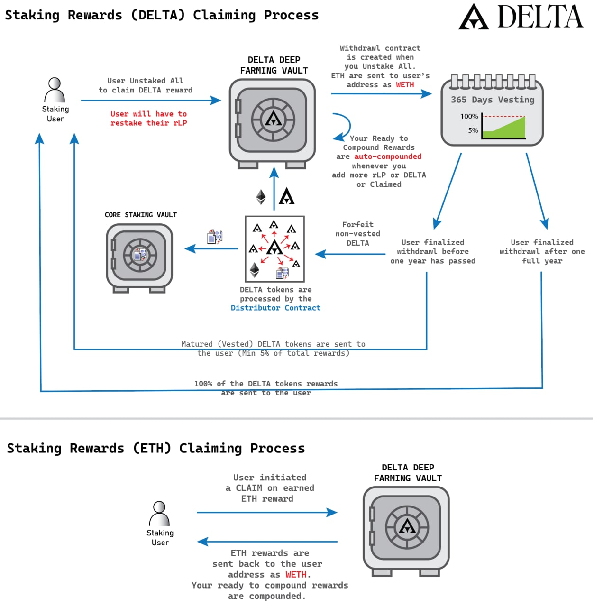

# Deep Farming Vault

The Deep Farming Vault (DFV) is used to generate yield on staked Delta and rLP tokens. By staking these tokens in the vault, users receive yield rewards in Ethereum and Delta. To maximize your yield, generated from the Deep Farming Vault, maintaining your multipliers and farming power is recommended.

### Staking in the Deep Farming Vault 

Users can stake the following tokens in the Deep Farming Vault:

* rLP
* Delta

### Farming Power 

Each user in the Deep Farming Vault is allocated farming power. This value dictates the amount of yield received.

$$
Farming Power = (rLP*ratio) + (stakedDelta*Booster) FarmingPower = (rLP∗ratio) + (stakedDelta∗Booster) ratio = 200
$$

### **Booster** 

The Deep Farming Vault has a booster for staked Delta. This booster varies from 1x to maximum 10x and requires weekly maintenance by depositing 10% of the principle using a **Burn Deposit** or **Compound Burn**.To start Delta farming with a 10x Booster, users have to activate the "**Burn Deposit**" checkbox. This will permanently lock 50% of the deposit in the Deep Farming Vault and start the 10x Booster. For weekly maintenance 10% of the principle needs to be deposited.

#### **Weekly Booster Maintenance** 

If the booster is not maintained, it will decrease each week by 3 points. There is a one week grace period after each drop which allows the user to get back to its original booster value **** +1. Only when 10% of the principle is deposited within the grace period and using compound burn or burn deposit.

<figure><figcaption></figcaption></figure>

#### **Burn Deposit:** 

A Burn deposit allows its user to start staking Delta with a 10x Booster. Using this mechanism, [permanently locks 50%](guides/staking-delta.md) of the deposit in the Deep Farming Vault the rest of the deposit is staked as usual.

#### **Compound Deposit:** 

The compound deposit mechanism allows its users to add Delta staking rewards directly to the Deep Farming Vault, where they can produce yield, rather than creating a withdrawal contract and waiting for the rewards to mature over a 12 month period. It can be used to significantly increase the users staked Delta Farming Power.

#### Compound Burn: 

The compound burn feature allows its user to maintain or upgrade their booster by using Delta Staking rewards. It requires a minimum of 10% of the principle in Delta rewards. If the user does not have enough Delta rewards to cover the 10%, the transaction will revert.Compound Burn can be performed once every 7 days.​

### Yield Rewards: 

The yield generated from the Deep Farming Vault comes from vesting schedule interruptions and is paid out in Delta and Ethereum. 20% of all yield is distributed in Ethereum while the remaining 80% is distributed as Delta:&#x20;

| Deep Farming Vault | CORE ecosystem | Dev Fund     | Burned    |
| ------------------ | -------------- | ------------ | --------- |
| 56% Delta          | -              | 8% Delta     | 16% Delta |
| 5% Ethereum        | 5% Ethereum    | 10% Ethereum | -         |

## Deep Farming Vault Withdrawal Process: 

There are two types of withdrawals to the Deep Farming Vault:

1. **Staked Token Withdrawals**
2. **Reward Withdrawals**

### Staked Token Withdrawals: 

**rLP token:** You can unstake your rLP tokens without any restrictions **Delta token:** When you unstake Delta from the Deep Farming Vault, they are placed in a withdrawal contract. You have to wait 14 days before you can withdraw your principle.

### **Reward Withdrawals:** 

#### Ethereum Staking Rewards: 

Vault deposits, rLP withdrawals and the "UNSTAKE ALL" button, automatically claims Ethereum rewards, allowing the user to save gas by using the aforementioned actions to claim.

#### Delta Staking Rewards: 

When claiming Delta rewards, a withdrawal contract is created which starts a **one year vesting cycle** for the staking rewards. Boosters for staked Delta are lost when the Delta withdrawal process is started.Delta is continuously maturing in that contract throughout the year. The user has the option to prematurely claim the Delta rewards, in this case, the immature Delta will be lost (distributed back to the Deep Farming Vault).

<figure><figcaption></figcaption></figure>

### Withdrawal Contract: 

When unstaking Delta or claiming Delta rewards, a withdrawal contract is created which starts a one year vesting cycle for the staking rewards and a 14 days maturing cycle for the staked Delta.

Upon finalizing the withdrawal, the user receives:

* 5% of the total Rewards
* Mature Delta

You may withdraw your principle after 14 days.

